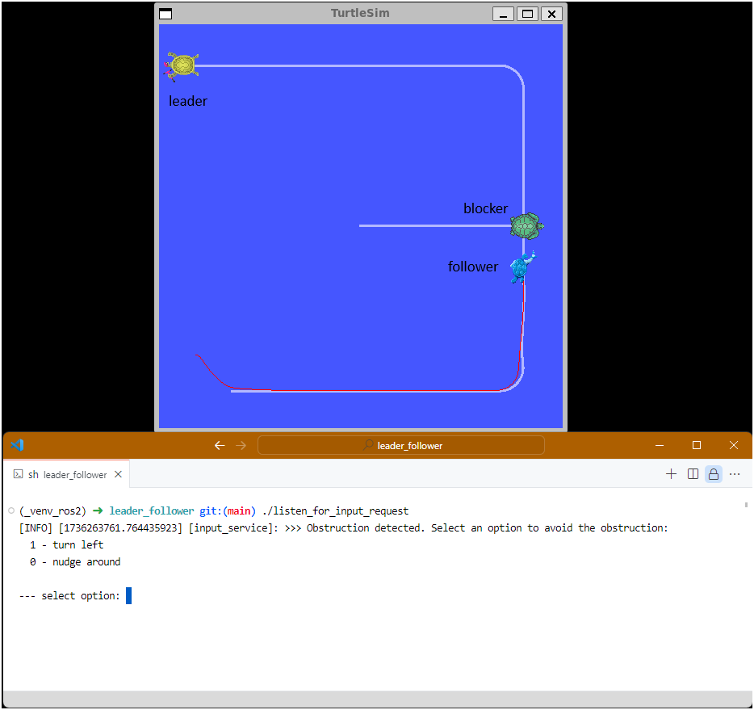
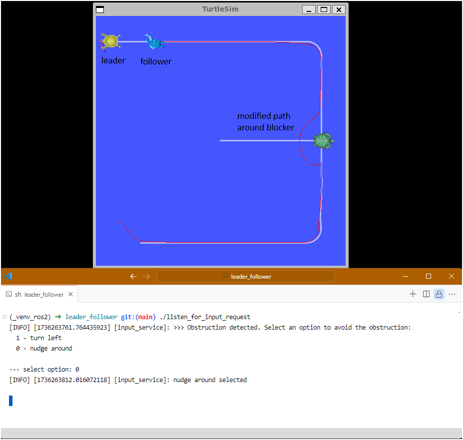

# leader_follower

## ros2 example using turtle environment

This project is to increase my learning of the Robot Operating System (ROS2). This project was configured using Windows Subsystem for Linux (WSL) as the platform for Ubuntu and ROS2. The intent is to use the standard examples using turtle sim where each turtle can publish pose data and interact with each other. Using the learnings the simulation has a lead turtle that performs a prescribed path. The lead turtle publishes its pose for the follower turtle to record as a desired path. The follower turtle controls its heading to follow the prescribed path. One design goal is to request input from the user any time the path is blocked. This user input is used to select from a given set of options for the follower turtle to navigate around the blockage. 

## Example Scenario

In this scenario the lead turtle has published the pose data and the follower turtle has recorded the pose data as its desired path. A third turtle moves into the path. The follower turtle detects the blockage since it consumes the pose data of this turtle and requests input from the user. 
 

 

The selects the option to nudge around. This option finds any points on the path that are within a prescribed radius from the pose of the blocking turtle. These points are moved outside the radius. 

